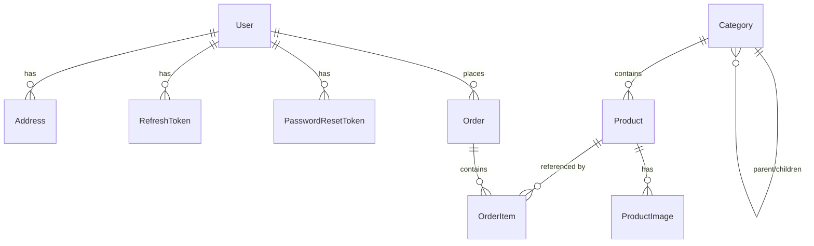

# Backend 00 — Database Design

This is the single source of truth for the schema. Every API guide in this
folder (`02`–`06`) builds against the tables defined here — don't redesign
entities inside a feature guide, extend this one and cross-link back.

Companion to `docs/01-auth.md` through `docs/06-orders.md` (the high-level
build guide) — this doc goes one level deeper: concrete column types, every
index, and the reasoning behind schema decisions, since you're using this
project to learn how to design a schema that won't need a rewrite once it
has real traffic.

## Conventions (apply these everywhere, not just where mentioned)

- **Primary keys: `uuid`, always.** Not auto-increment ints. Two reasons:
  (1) sequential ints leak business volume (`/orders/1042` tells a
  competitor how many orders you've processed) and make id-guessing attacks
  trivial — `06-orders.md` calls this out specifically; (2) uuids let you
  generate an id client-side or in a queue worker before the row exists,
  which matters once you introduce background jobs (see the Scalability
  section in `05-checkout-payments-api.md`). The cost — slightly larger
  index size than `int` — is irrelevant at this scale.
- **Money as integer cents, never `float`/`decimal` gymnastics in app
  code.** `priceCents: 450` means 4.50, not 450.00. Floats introduce
  rounding errors the moment you sum a cart; this is the single most common
  real-world e-commerce bug and it's free to avoid by just picking the
  right type up front.
- **Timestamps**: every table gets `createdAt` (`@default(now())`) and
  `updatedAt` (`@updatedAt`, Prisma manages this automatically on every
  write). Domain-specific timestamps (`paidAt`, `deliveredAt`) are
  *nullable* and set explicitly by application code when that event
  actually happens — don't infer "was this paid" from a status string
  alone when you can have a real timestamp to sort/filter/report on.
- **Soft state via enums, not booleans.** `Product.status` is
  `DRAFT | ACTIVE | ARCHIVED`, not `isActive: boolean` — a boolean can't
  grow a third state later without a migration that also has to rewrite
  application logic everywhere it's read. An enum can.
- **Snapshots over live joins for anything financial or historical.**
  `OrderItem.productName`/`unitPriceCents` are copied at order time, not
  joined live from `Product`. A product's price changing next week must
  never rewrite what a customer was actually charged last week.

## Entity-relationship overview

**Cart is deliberately not in this diagram.** Per `docs/04-cart.md`, cart
state lives in Redis (`cart:{userId}` / `cart:guest:{guestId}` keys), not
Postgres — it's disposable, high-write data with no reporting/durability
need, and Redis is already provisioned. Don't add a `Cart`/`CartItem`
table; `04-cart-api.md` in this folder covers the Redis implementation.

## Tables

### `users`

| Column | Type | Notes |
|---|---|---|
| `id` | uuid PK | |
| `email` | text, **unique index** | lowercase on write in app code — Postgres unique indexes are case-sensitive by default, don't rely on the DB to dedupe `Foo@x.com` vs `foo@x.com` |
| `passwordHash` | text | bcrypt hash, never the plaintext, never reversible |
| `firstName`, `lastName` | text | |
| `phone` | text, nullable | |
| `role` | enum `CUSTOMER \| ADMIN` | default `CUSTOMER` |
| `emailVerifiedAt` | timestamp, nullable | unset in v1 unless you build verification |
| `createdAt`, `updatedAt` | timestamp | |

### `addresses`

| Column | Type | Notes |
|---|---|---|
| `id` | uuid PK | |
| `userId` | uuid FK → `users.id`, **indexed**, `onDelete: Cascade` | a user's addresses die with the user |
| `label`, `line1`, `line2`, `city`, `region`, `postalCode`, `country` | text | |
| `isDefault` | boolean | |

Index on `userId` — every read of this table is "give me this user's
addresses."

### `refresh_tokens`

| Column | Type | Notes |
|---|---|---|
| `id` | uuid PK | |
| `userId` | uuid FK, **indexed** | |
| `tokenHash` | text, **unique** | store a hash of the token, never the raw value — same principle as passwords: if this table leaks, the tokens shouldn't be directly usable |
| `expiresAt` | timestamp | |
| `revokedAt` | timestamp, nullable | logout / rotation sets this instead of deleting the row — keeps an audit trail of token reuse attempts |
| `replacedByTokenId` | uuid, nullable | links a rotated token to its replacement, lets you detect refresh-token replay (a revoked token being reused is a strong signal of theft) |

### `password_reset_tokens`

Same shape as `refresh_tokens` minus rotation (`id`, `userId` FK indexed,
`tokenHash` unique, `expiresAt`, `usedAt` nullable).

### `categories`

| Column | Type | Notes |
|---|---|---|
| `id` | uuid PK | |
| `name` | text | |
| `slug` | text, **unique index** | URL-facing identifier |
| `parentId` | uuid, nullable, self-FK, **indexed**, `onDelete: SetNull` | adjacency list — see `docs/02-products-and-categories.md` for why this beats nested-set for a shallow grocery taxonomy. `SetNull` (not `Cascade`) so deleting a parent category doesn't cascade-delete its children — it orphans them to top-level, which is the safer default for admin-driven deletes |
| `description`, `imageUrl` | text, nullable | |
| `sortOrder` | int, default 0 | manual display ordering |

### `products`

| Column | Type | Notes |
|---|---|---|
| `id` | uuid PK | |
| `slug` | text, **unique index** | PDP route param, per `03-product-detail-page.md` |
| `name` | text | |
| `description` | text | |
| `priceCents` | int | |
| `compareAtPriceCents` | int, nullable | "was X, now Y" display |
| `currency` | text, default `KES` | |
| `unit` | text | `kg`, `bunch`, `dozen`, `piece`, `litre` — grocery-specific, free text is fine, don't over-model as an enum since new units will show up |
| `stock` | int, default 0 | |
| `sku` | text, nullable, **unique** | |
| `isOrganic` | boolean | real filterable field per the product's own positioning, not a tag |
| `status` | enum `DRAFT \| ACTIVE \| ARCHIVED`, **indexed** | indexed because every public listing query filters `status = 'ACTIVE'` |
| `categoryId` | uuid FK, **indexed** | |
| `createdAt`, `updatedAt` | timestamp | |

### `product_images`

| Column | Type | Notes |
|---|---|---|
| `id` | uuid PK | |
| `productId` | uuid FK, **indexed**, `onDelete: Cascade` | |
| `url` | text | |
| `altText` | text, nullable | |
| `sortOrder` | int, default 0 | gallery order |

Separate table, not a `jsonb` array on `Product` — lets you reorder/caption
images independently and matches `03-product-detail-page.md`'s gallery
requirement without JSON-path queries.

### `orders`

| Column | Type | Notes |
|---|---|---|
| `id` | uuid PK | |
| `userId` | uuid FK, **indexed** | checkout requires login (v1 decision, `05-checkout-and-payments.md`) |
| `status` | enum, **indexed** | `PENDING_PAYMENT \| PAID \| PROCESSING \| FULFILLED \| OUT_FOR_DELIVERY \| DELIVERED \| CANCELLED` — indexed because the admin order list filters by status constantly |
| `totalCents`, `deliveryFeeCents` | int | |
| `currency` | text | |
| `shippingLine1/2/City/Region/PostalCode/Country` | text | **snapshot fields**, not an FK to `addresses` — see Conventions above |
| `paymentProvider` | enum `STRIPE \| COD` | |
| `paymentReference` | text, nullable | Stripe PaymentIntent id, null for COD |
| `placedAt`, `paidAt`, `fulfilledAt`, `deliveredAt`, `cancelledAt` | timestamp, nullable except `placedAt` | one column per real-world event, per Conventions above |

### `order_items`

| Column | Type | Notes |
|---|---|---|
| `id` | uuid PK | |
| `orderId` | uuid FK, **indexed**, `onDelete: Cascade` | |
| `productId` | uuid FK (no cascade — keep for admin traceability even if the product is later archived) | |
| `productName`, `unitPriceCents` | text/int | **snapshot at order time** |
| `quantity`, `subtotalCents` | int | |

## Indexing summary (why each one exists)

| Index | Query it serves |
|---|---|
| `users.email` unique | login lookup, register duplicate check |
| `addresses.userId` | account address list |
| `refresh_tokens.userId`, `.tokenHash` unique | refresh/logout lookup |
| `password_reset_tokens.userId`, `.tokenHash` unique | reset flow lookup |
| `categories.slug` unique | category page route |
| `categories.parentId` | building the category tree |
| `products.slug` unique | PDP route |
| `products.categoryId` | category filter on product list |
| `products.status` | public listings excluding drafts/archived |
| `product_images.productId` | gallery fetch |
| `orders.userId` | customer order history |
| `orders.status` | admin order list filter |
| `order_items.orderId` | order detail line items |

Every index above maps to a real query one of the API guides in this folder
builds — resist adding indexes "just in case." Each one has a write-time
cost; only add one when you can point at the query it serves.

## Scaling this schema later (read now, act when you actually need it)

- **Connection pooling**: Prisma opens a real Postgres connection per
  concurrent request by default. Fine for one `api` replica; once
  `docker-production.yml`'s `replicas: 2` (or more) is real traffic, put
  **PgBouncer** in front of Postgres (transaction pooling mode) rather than
  raising `max_connections` — Postgres connections are expensive, PgBouncer
  connections are cheap. Not needed for local dev or early production.
- **Read replicas**: if `GET /products` read traffic ever dominates writes
  (likely, for a catalog), a Postgres read replica with Prisma's
  `$extends` read/write routing is the next lever — well after caching
  (below) stops being enough, not before.
- **Caching hot reads**: `GET /products` and `GET /categories` are prime
  Redis-cache candidates (you already have Redis for cart) — cache the
  serialized response keyed by query params, invalidate on
  admin write. Covered concretely in `03-products-categories-api.md`.
- **Partitioning `orders`**: not needed until you have millions of rows —
  mentioned here only so you don't reach for it prematurely. A `status` +
  `createdAt` composite index will carry you a long way past that.

## What "done" looks like for this doc

- You can point to every table above and say which API guide in this
  folder creates/reads/writes it.
- No entity here duplicates or contradicts `docs/01-auth.md` through
  `docs/06-orders.md` — if you change something here, update the
  corresponding high-level doc's "Data model" section too.
